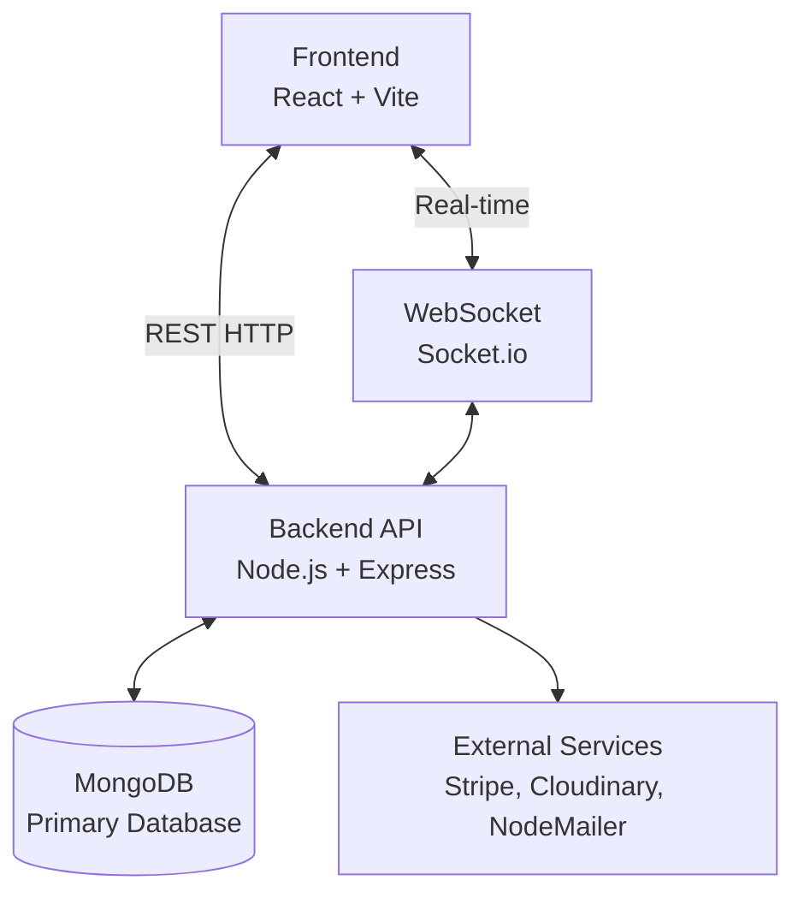
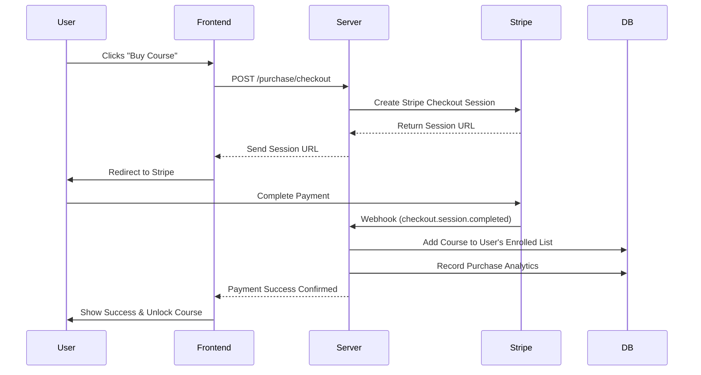
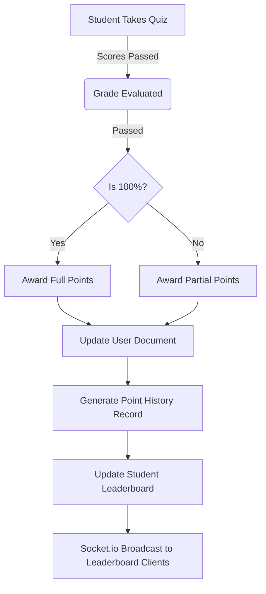

<div align="center">


# 🎓 EduHub LMS Platform

### Next-Generation E-Learning Experience

<div align="center">
  <a href="https://lms-eduhub.vercel.app/">
    
  </a>
  <a href="https://lms-eduhub.vercel.app/">
    
  </a>
</div>

<p align="center">
  A comprehensive, full-stack Learning Management System connecting passionate educators with eager learners around the globe.
</p>

</div>

---

## 📋 Table of Contents

- [📖 Introduction](#-introduction)
- [✨ Key Features](#-key-features)
- [🎯 Feature Showcase](#-feature-showcase)
- [📊 System Architecture](#-system-architecture)
- [⚙️ Tech Stack](#️-tech-stack)
- [📁 Project Structure](#-project-structure)
- [🚀 Getting Started](#-getting-started)
- [🔐 Environment Configuration](#-environment-configuration)
- [🤝 Contributing](#-contributing)
- [📄 License](#-license)

---

## 📖 Introduction

**EduHub LMS** is a modern, production-ready full-stack learning platform designed to revolutionize digital education. Built with **React Native (Vite)** and a robust **Node.js/Express** backend, it offers:

- 🎥 **HD Video Streaming** with progress tracking
- 💯 **Gamification** via leaderboards and points systems
- 💳 **Secure Payments** via Stripe
- 📝 **Interactive Quizzes & Notes** for active learning
- 💬 **Real-time Notifications & Q&A** powered by Socket.io
- 📜 **Dynamic Certificates** that are publicly verifiable
- 👥 **Advanced Role Management** (Admin, Teacher, Student)

---

## ✨ Key Features

### For Students (Learners)
- 🔍 **Smart Course Search** - Find courses with dynamic filters (level, category).
- 📅 **Interactive Dashboard** - Track enrolled courses and learning progress.
- 🎓 **Dynamic Certifications** - Earn and share verifiable certificates upon completion.
- 💬 **Course Q&A & Notes** - Engage with teachers directly and store private lecture notes.
- 💰 **Secure Checkout** - Seamless course purchases using Stripe.
- 🏆 **Gamified Learning** - Earn points for quizzes/completions and climb the Leaderboard.
- 📱 **Real-time Alerts** - Get instant notifications for replies, announcements, and more.

### For Instructors (Teachers)
- 📊 **Earnings Dashboard** - Track course sales, enrollments, and revenue metrics.
- 🛠️ **Course Builder** - Upload videos, add descriptions, and manage curriculum modules.
- 📝 **Quiz Maker** - Create graded assessments for students.
- 💬 **Student Engagement** - Answer Q&A threads and interact via blog comments.
- 🌐 **Instructor Profile** - Showcase expertise with social links and published courses.

### For Admins
- 🎛️ **Super Dashboard** - Complete system oversight, user analytics, and revenue tracking.
- 👤 **Role Management** - Promote users, ban accounts, and manage system permissions.
- 🏪 **Content Moderation** - Manage course categories, blog posts, and reviews.
- 💸 **Site Settings** - Customize branding, modify AdSense integration, and control site-wide features.
- 📢 **Broadcast Notifications** - Send real-time global messages to all active users.

---

## 🎯 Feature Showcase

We have carefully designed the interface to be responsive, intuitive, and visually stunning. Below are key highlights of the platform.

### 🏠 Platform Gateway & Discovery

| User Interface | Feature Details |
| :---: | :--- |
| <div align="center"></div> | **Dynamic Homepage**<br><br>A visually engaging landing page featuring top-rated courses, category filters, and immediate access to the learning catalog. |
| <div align="center"></div> | **Course Exploration**<br><br>Advanced course catalog with infinite scrolling, dynamic searching, and comprehensive category filtering. |
| <div align="center"></div> | **Course Details & Checkout**<br><br>Detailed presentation showing curriculum, instructor info, requirements, and secure Stripe checkout integration. |

### 🎓 Learning & Student Experience

| User Interface | Feature Details |
| :---: | :--- |
| <div align="center"></div> | **Student Profile & Dashboard**<br><br>Centralized learning hub for students to track enrolled courses, view certificates, and manage their points history. |

### 📰 Community & Blog

| User Interface | Feature Details |
| :---: | :--- |
| <div align="center"></div> | **Community Blog Hub**<br><br>A space for instructors to share knowledge and for students to read articles related to their tech stacks. |
| <div align="center"></div> | **Article & Interactions**<br><br>Immersive reading experience featuring rich-text formatting, comment sections, and social sharing capabilities. |

### 👮 Platform Administration

| User Interface | Feature Details |
| :---: | :--- |
| <div align="center"></div> | **Admin Mission Control**<br><br>Comprehensive admin dashboard showing real-time revenue, enrollment stats, user growth, and actionable analytics. |


---

## 📊 System Architecture

Our platform uses a distinct separation of concerns, ensuring high performance and ease of maintenance. Below are the detailed flows of our core systems.

### 1. High-Level Data Flow



### 2. Course Purchase & Enrollment Flow



### 3. Gamification & Gamified Learning Flow



---

## ⚙️ Tech Stack

### Frontend
- **Framework**: React 18, Vite
- **Styling**: Tailwind CSS, Shadcn UI (Radix)
- **State Management**: Redux Toolkit
- **Data Fetching**: React Query (TanStack)
- **Routing**: React Router DOM

### Backend
- **Runtime**: Node.js
- **Framework**: Express.js
- **Database**: MongoDB (Mongoose ODM)
- **Authentication**: JWT (JSON Web Tokens), bcryptjs
- **Real-time**: Socket.io

### Third-Party Services
- **Payments**: Stripe Checkout
- **Media Storage**: Cloudinary (Video & Image hosting)
- **Email Delivery**: Nodemailer (SMTP)

---

## 📁 Project Structure

```bash
LMS-WebSite/
├── client/                     # Frontend Application (Vite + React)
│   ├── src/
│   │   ├── assets/             # Images and static assets
│   │   ├── components/         # Reusable React components (UI, Admin, etc.)
│   │   ├── features/           # Redux slices (auth, course, etc.)
│   │   ├── lib/                # API configurations, Socket connection
│   │   ├── Pages/              # Page components (Home, Course, Dashboard)
│   │   └── App.jsx             # Main Router configuration
│
├── server/                     # Backend API (Node.js + Express)
│   ├── Controller/             # Business logic (User, Course, Auth, etc.)
│   ├── middleware/             # Auth & Role verification (Admin/Teacher)
│   ├── models/                 # Mongoose DB Schemas
│   ├── Routers/                # API Route definitions
│   ├── utils/                  # Cloudinary, Stripe, Email helpers
│   └── index.js                # Server entry point
│
├── .env                        # Server Environment Variables
└── client/.env                 # Client Environment Variables
```

---

## 🚀 Getting Started

### Prerequisites
- **Node.js**: 18.x or higher
- **MongoDB**: Atlas account or local instance
- **Cloudinary**: Account for course media
- **Stripe**: Developer account for payments

### Installation

1. **Clone the repository**
   ```bash
   git clone https://github.com/CodeCommandBD/LMS-WebSite.git
   cd LMS-WebSite
   ```

2. **Install Server Dependencies**
   ```bash
   npm install
   ```

3. **Install Client Dependencies**
   ```bash
   cd client
   npm install
   ```

4. **Run Development Servers (Concurrently)**
   Open two terminals:

   *Terminal 1 (Backend):*
   ```bash
   # From root directory
   npm run dev
   ```

   *Terminal 2 (Frontend):*
   ```bash
   # From client directory
   npm run dev
   ```

   Visit `http://localhost:5173`

---

## 🔐 Environment Configuration

Create a `.env` file in the **root (`server`) directory**:

```env
# Server
PORT=4000
NODE_ENV=development

# Database
MONGO_URL=mongodb+srv://...

# Security
JWT_SECRET=your_super_secret_key

# Cloudinary (Media)
CLOUD_NAME=your_cloud_name
CLOUD_API_KEY=your_api_key
CLOUD_API_SECRET=your_api_secret

# Stripe (Payments)
STRIPE_SECRET_KEY=sk_test_...
STRIPE_WEBHOOK_SECRET=whsec_...

# Email (Nodemailer)
EMAIL_HOST=smtp.gmail.com
EMAIL_PORT=587
EMAIL_USER=your_email@gmail.com
EMAIL_PASS=your_app_password
EMAIL_FROM="LMS Platform <noreply@lms.com>"

# Frontend URL
CLIENT_URL=http://localhost:5173
```

Create a `.env` file in the **`client` directory**:

```env
VITE_API_URL=http://localhost:4000/api/v1
VITE_SERVER_URL=http://localhost:4000
```

---

## 🤝 Contributing
Contributions are always welcome! Feel free to open issues or submit Pull Requests to help improve the platform.

1. Fork the Project
2. Create your Feature Branch (`git checkout -b feature/AmazingFeature`)
3. Commit your Changes (`git commit -m 'Add some AmazingFeature'`)
4. Push to the Branch (`git push origin feature/AmazingFeature`)
5. Open a Pull Request

---

## 📄 License
This project is licensed under the ISC License. 

---

<div align="center">
  <b>Built for modern education. Enjoy learning! 🚀</b>
</div>
