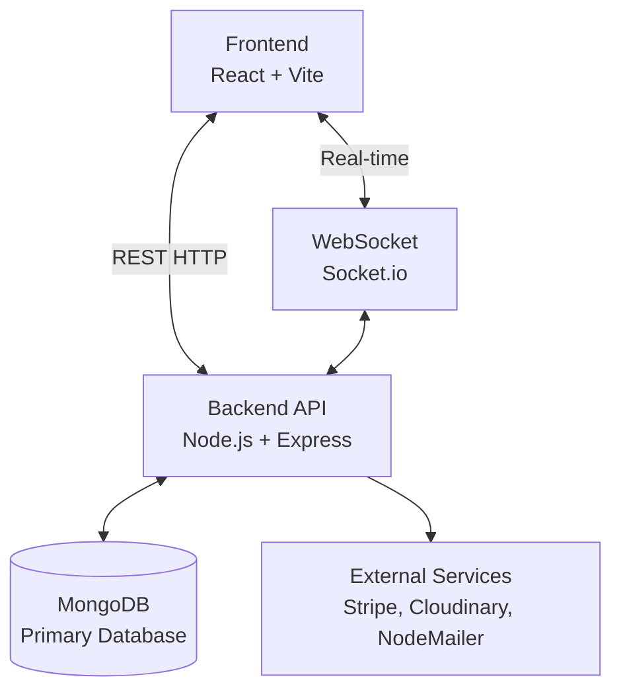

<div align="center">


# 🎓 EduHub LMS Platform

### Next-Generation E-Learning Experience

<div align="center">
  <a href="https://lms-eduhub.vercel.app/">
    
  </a>
  <a href="https://lms-eduhub.vercel.app/">
    
  </a>
</div>

<p align="center">
  A comprehensive, highly secure full-stack Learning Management System connecting passionate educators with eager learners around the globe.
</p>

</div>

---

## 📋 Table of Contents

- [📖 Introduction](#-introduction)
- [🛡️ Enterprise Security & Data Integrity](#️-enterprise-security--data-integrity)
- [✨ Key Features](#-key-features)
- [🎯 Feature Showcase](#-feature-showcase)
- [📊 System Architecture](#-system-architecture)
- [⚙️ Tech Stack](#️-tech-stack)
- [🚀 Getting Started](#-getting-started)
- [🔐 Environment Configuration](#-environment-configuration)
- [🤝 Contributing](#-contributing)

---

## 📖 Introduction

**EduHub LMS** is a modern, production-ready full-stack learning platform designed to revolutionize digital education. Built with **React Native (Vite)** and a robust **Node.js/Express** backend, it offers highly engaging learning experiences wrapped in enterprise-grade security.

---

## 🛡️ Enterprise Security & Data Integrity

Our platform has undergone rigorous deep security audits to ensure zero data leaks and maximum protection:

- **🔒 IDOR Protection**: Strict ownership validation on all content creation, modification, and deletion (Blogs, Courses, Comments, Q&A).
- **🛑 Mass Assignment Prevention**: Whitelisted payload fields for updates to prevent malicious privilege escalation.
- **🧹 Atomic Cascade Deletion**: Deleting a course or user flawlessly cleans up associated Cart items, Q&As, Notes, Forum Posts, and Comments, preventing orphaned data corruption.
- **🚷 Secure Role Management**: Admin accounts are strictly managed at the database level. Admin registration and UI role selectors are completely blocked to prevent unauthorized access.
- **🛡️ Rate Limiting & Helmet**: API endpoints are protected against DDoS, Brute Force attacks, XSS, and NoSQL Injection.
- **🚨 Centralized Error Handling**: Custom `globalErrorMiddleware` ensures no sensitive stack traces are leaked to the client while providing detailed logging for developers.

---

## ✨ Key Features

### For Students (Learners)
- 🔍 **Smart Course Search** - Find courses with dynamic filters (level, category).
- 📅 **Interactive Dashboard** - Track enrolled courses and learning progress.
- 🎓 **Dynamic Certifications** - Earn and share verifiable certificates upon completion.
- 💬 **Course Q&A & Notes** - Engage with teachers directly and store private lecture notes.
- 💰 **Secure Checkout** - Seamless course purchases using Stripe.
- 🏆 **Gamified Learning** - Earn points for quizzes/completions and climb the Leaderboard.
- 📱 **Real-time Alerts** - Get instant notifications for replies, announcements, and more.

### For Instructors (Teachers)
- 📊 **Earnings Dashboard** - Track course sales, enrollments, and revenue metrics.
- 🛠️ **Course Builder** - Upload videos, add descriptions, manage curriculum modules.
- 📝 **Quiz Maker** - Create graded assessments for students.
- 💬 **Student Engagement** - Answer Q&A threads and interact via blog comments.
- 🌐 **Instructor Profile** - Showcase expertise with social links and published courses.

### For Admins
- 🎛️ **Super Dashboard** - Complete system oversight, user analytics, and revenue tracking.
- 👤 **Role Management** - Promote users, ban accounts, and manage system permissions.
- 🏪 **Content Moderation** - Manage course categories, blog posts, and reviews.
- 📢 **Broadcast Notifications** - Send real-time global messages to all active users.

---

## 🎯 Feature Showcase

We have carefully designed the interface to be responsive, intuitive, and visually stunning.

### 🏠 Platform Gateway & Discovery
| User Interface | Feature Details |
| :---: | :--- |
| <div align="center"></div> | **Dynamic Homepage**<br><br>A visually engaging landing page featuring top-rated courses, category filters, and immediate access to the learning catalog. |
| <div align="center"></div> | **Course Details & Checkout**<br><br>Detailed presentation showing curriculum, instructor info, requirements, and secure Stripe checkout integration. |

### 🎓 Learning & Community
| User Interface | Feature Details |
| :---: | :--- |
| <div align="center"></div> | **Student Profile & Dashboard**<br><br>Centralized learning hub for students to track enrolled courses, view certificates, and manage their points history. |
| <div align="center"></div> | **Community Blog Hub**<br><br>Immersive reading experience featuring rich-text formatting, comment sections, and social sharing capabilities. |

---

## 📊 System Architecture

### High-Level Data Flow


---

## ⚙️ Tech Stack

### Frontend
- **Framework**: React 18, Vite
- **Styling**: Tailwind CSS, Shadcn UI
- **State Management**: Redux Toolkit
- **Data Fetching**: React Query (TanStack)

### Backend
- **Runtime**: Node.js
- **Framework**: Express.js
- **Database**: MongoDB (Mongoose ODM)
- **Authentication**: JWT, bcryptjs
- **Real-time**: Socket.io

---

## 🚀 Getting Started

### Prerequisites
- **Node.js**: 18.x or higher
- **MongoDB**: Atlas account or local instance
- **Cloudinary**: Account for course media
- **Stripe**: Developer account for payments

### Installation

1. **Clone the repository**
   ```bash
   git clone https://github.com/CodeCommandBD/LMS-WebSite.git
   cd LMS-WebSite
   ```

2. **Install Dependencies**
   ```bash
   npm install              # Install backend dependencies
   cd client && npm install # Install frontend dependencies
   cd ..
   ```

3. **Configure Environment Variables** (See below)

4. **Run Development Servers**
   ```bash
   # Terminal 1: Run Backend (from root)
   npm run dev

   # Terminal 2: Run Frontend (from /client)
   cd client
   npm run dev
   ```

---

## 🔐 Environment Configuration

Create a `.env` file in the **root directory**:

```env
# Server
PORT=4000
NODE_ENV=development

# Database
MONGO_URL=mongodb+srv://...


# Cloudinary (Media)
CLOUD_NAME=your_cloud_name
CLOUD_API_KEY=your_api_key
CLOUD_API_SECRET=your_api_secret

# Stripe (Payments)
STRIPE_SECRET_KEY=sk_test_...
STRIPE_WEBHOOK_SECRET=whsec_...

```

Create a `.env` file in the **`client` directory**:

```env
VITE_API_URL=http://localhost:4000/api/v1
VITE_SERVER_URL=http://localhost:4000
```

> **Note on Admin Access**: For security reasons, the Admin role cannot be created via the registration UI. Admins must be seeded directly into the MongoDB database or created via the provided `server/create-admin.js` script.

---

<div align="center">
  <b>Built for modern education. Enjoy learning! 🚀</b>
</div>
